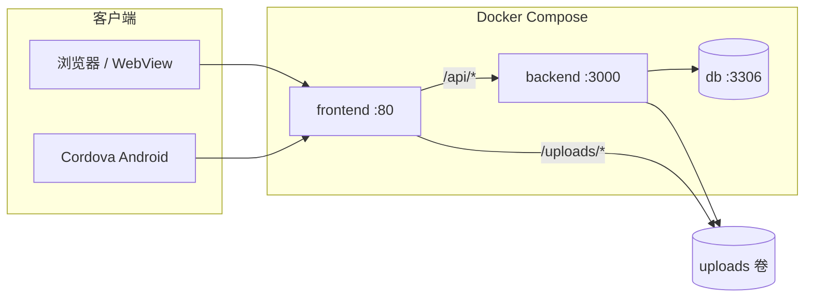

# test_platform（个人所得税演示平台）

面向移动 Web / Android 壳的**个人所得税相关演示系统**：用户端为大量静态 H5 页面 + 少量 Vue 构建产物；业务数据与权限由 Node.js API 写入 MySQL；管理后台提供用户、激活码、统计与运维能力。可选 Cordova 工程打包为 Android 应用。

> **说明**：本项目为演示/测试用途的内部平台，生产部署务必修改默认密码与密钥，并评估合规与数据安全要求。

---

## 技术栈

| 层级 | 技术 |
|------|------|
| 用户前端 | 静态 HTML/CSS/JS，Vite + Vue 3（仅部分入口，如 `index.html` 构建产物） |
| 反向代理 | Nginx（Docker 内监听 80，`/api/` 反代后端） |
| 后端 API | Node.js 18 + Express |
| 数据库 | MySQL 8.0 |
| 容器编排 | Docker Compose |
| 移动端壳 | Apache Cordova（`cordova-app/`，Android） |

---

## 系统架构



**请求路径简述**

- 页面与静态资源：由 `frontend` 容器 Nginx 直接提供（`*.html`、`/js/`、`/css/` 等）。
- 接口：`/api/*` → `backend:3000`（兼容历史路径如 `/api/auth.php`、`/api/tax.php`）。
- 上传文件：后端写入 `UPLOAD_DIR`，与前端共享 Docker 卷 `test_platform_uploads_static`，对外路径为 `/uploads/`。

---

## 目录结构

```
test_platform/
├── backend/                 # Express API
│   ├── server.js            # 主服务（路由、建表迁移、业务逻辑）
│   ├── schema.sql           # 表结构参考（启动时 server.js 也会 CREATE IF NOT EXISTS）
│   ├── register-guard.js    # 注册风控
│   ├── serverMonitor.js     # 监控与邮件告警
│   └── mail.js              # SMTP 发信
├── frontend/                # 用户 H5 + 管理端页面
│   ├── *.html               # 各业务页面（办税、申报、银行卡、消息等）
│   ├── admin_panel.html     # 管理控制台
│   ├── admin_login.html     # 管理端登录
│   ├── public/js/           # 公共脚本（auth、admin_panel 等）
│   ├── nginx.conf           # 生产 Nginx 配置
│   └── Dockerfile           # 多阶段构建：Vite build + 拷贝静态页
├── cordova-app/             # Android 壳（WebView 加载远程或本地 H5）
├── scripts/
│   ├── deploy.sh            # 一键 docker compose 构建并启动
│   └── enable-git-hooks.sh  # 可选：commit 后自动部署
├── docker-compose.yml
└── README.md
```

---

## 快速开始（Docker）

**环境要求**：Docker、Docker Compose。

```bash
# 克隆后进入仓库根目录
cd test_platform

# 构建并启动（MySQL + API + Nginx）
./scripts/deploy.sh
```

启动后默认访问：

| 服务 | 地址 | 说明 |
|------|------|------|
| 用户端 | http://localhost/ | 根路径 302 到登录页 `index.html` |
| 管理后台 | http://localhost/admin_login.html | 登录后进入 `admin_panel.html` |
| API 直连 | http://localhost:3000/api/health | 健康检查 |
| MySQL | `localhost:3308` | 容器映射端口（避免占用宿主机 3306） |

仅重建部分服务示例：

```bash
DEPLOY_SERVICES="frontend" ./scripts/deploy.sh
```

---

## 环境变量

在 `docker-compose.yml` 的 `backend` 服务中配置，或通过 `.env`（勿提交敏感信息）注入。

| 变量 | 默认值 / 说明 |
|------|----------------|
| `DB_HOST` | `db`（Compose 服务名） |
| `DB_PORT` | `3306` |
| `DB_USER` / `DB_PASSWORD` / `DB_DATABASE` | `root` / `password` / `personal_tax` |
| `JWT_SECRET` | 未设置时使用开发默认值，**生产必须设置** |
| `ADMIN_PANEL_USER` / `ADMIN_PANEL_PASSWORD` | 管理后台登录，默认 `admin` / `640810` |
| `ADMIN_ACTIVATION_KEY` | 旧版 `auth.php` 发码接口密钥，未设置则不可用 |
| `REGISTER_STORE_PLAIN_PASSWORD` | `1` 时在库中保存明文密码供后台查看，生产建议 `0` |
| `UPLOAD_DIR` | `/data/uploads` |
| `SMTP_*` / `MONITOR_ALERT_EMAIL` | 服务器监控告警邮件（可选） |

数据库首次由 API 启动时自动 `CREATE DATABASE` 并 `CREATE TABLE IF NOT EXISTS`；完整字段以 `backend/server.js` 内 `createTables()` 为准，`schema.sql` 作对照参考。

---

## 主要功能模块

### 用户端（C 端）

- **账号**：注册、登录、JWT 会话；注册后需**激活码**激活（`account_active`）。
- **办税演示**：税务记录、任职受雇、家庭成员、银行卡、专项附加扣除、申报记录等（多页面 + `*.php` 风格 API）。
- **消息与反馈**：站内消息、用户反馈（BUG / 建议）。
- **渠道**：注册来源、闲鱼批量激活码（`note` 含「闲鱼」）、激活来源写入用户渠道分析。
- **可配置 UI**：`mine_ui` JSON、安装包下载链接、闲鱼购买文案、主题/字体等（管理后台「用户端外观」「引导安装」）。

### 管理后台（`admin_panel.html`）

需 `admin` 超级账号或具备对应菜单权限的子账号：

| 菜单 | 能力概要 |
|------|----------|
| 系统设置 / 引导安装 / 用户端外观 | 全局配置、安装包、UI 资源上传 |
| 激活码 | 单发、闲鱼批量 100 条、非闲鱼/闲鱼列表及筛选查询 |
| 注册用户 / 用户数据 | 用户列表、封禁、详情、工资与渠道分析 |
| 用户反馈 | 查看与回复 |
| 登录流水 | 管理账号与普通用户登录记录 |
| 数据统计 / 接口统计 | DAU、转化、页面事件、API 聚合 |
| 后台账号权限 | 子账号与菜单授权（仅 super） |
| 服务器监控 | 磁盘/服务探活、邮件告警 |

默认超级账号见环境变量 `ADMIN_PANEL_*`。

---

## API 约定（摘要）

- **认证**：用户接口 Header `Authorization: Bearer <jwt>`；管理接口为管理端 JWT（`admin_panel` 登录获取）。
- **兼容路径**：保留 `GET/POST /api/auth.php`、`/api/tax.php`、`/api/user.php` 等，便于 H5 沿用旧调用方式。
- **管理 REST**：`/api/admin/*`（如 `login`、`users`、`codes`、`settings`、`analytics/*`）。
- **公开配置**：`/api/public/mine-ui`、`/api/public/install-packages`。
- **健康检查**：`/health`、`/api/health`。

详细路由见 `backend/server.js` 文件末尾注册段。

---

## 本地开发

### 仅改前端静态页

修改 `frontend/` 下 HTML/JS/CSS 后执行部署脚本重建 `frontend` 镜像，或本地用任意静态服务器挂载 `frontend/`（接口需指向已运行的 API）。

### 后端

```bash
cd backend
npm install
# 需可访问的 MySQL，并设置 DB_*、JWT_SECRET 等环境变量
node server.js
```

### 前端 Vite（可选）

```bash
cd frontend
npm install
npm run dev    # 开发服务器
npm run build  # 产出 dist/（Docker 构建会执行）
```

生产镜像会将 `dist/` 与大量独立 `*.html` 一并打入 Nginx 根目录。

---

## Cordova Android

```bash
cd cordova-app
# 需本机 Android SDK / Gradle；config.xml 中配置远程 H5 地址或打包 www
cordova build android
```

应用 ID：`com.testplatform.app`，显示名「个人所得税」。壳内通过 WebView 加载站点；具体入口 URL 在 Cordova 配置与 `www/index.html` 中维护。

---

## 部署与运维

- **推荐**：服务器上 `./scripts/deploy.sh`（`docker compose up -d --build`）。
- **外网访问**：确保云安全组 / 防火墙放行 **TCP 80**（若上 HTTPS 则 443）；`docker-compose.yml` 中 frontend 已绑定 `0.0.0.0:80`。
- **探活失败**：`docker compose logs frontend backend`；本机 `curl -sf http://127.0.0.1/`。
- **数据持久化**：MySQL 卷 `personal_tax_mysql_data`；上传文件卷 `test_platform_uploads_static`。
- **Git 钩子（可选）**：`./scripts/enable-git-hooks.sh` 可在每次 commit 后自动部署（按需启用）。

---

## 生产安全清单

- [ ] 修改 `ADMIN_PANEL_PASSWORD`、`JWT_SECRET`、MySQL `MYSQL_ROOT_PASSWORD`
- [ ] 关闭或限制 `REGISTER_STORE_PLAIN_PASSWORD`
- [ ] 配置 HTTPS（Nginx 终止 TLS 或前置负载均衡）
- [ ] 限制管理后台访问来源（IP 白名单 / VPN）
- [ ] 定期备份 `personal_tax_mysql_data` 与 `uploads` 卷
- [ ] 审查 Cordova `allow-navigation` 与远程 H5 域名，避免任意跳转风险

---

## 许可证与用途

仓库为内部测试平台；未在根目录声明开源许可证时，默认保留所有权利。使用前请确认业务合规性。
