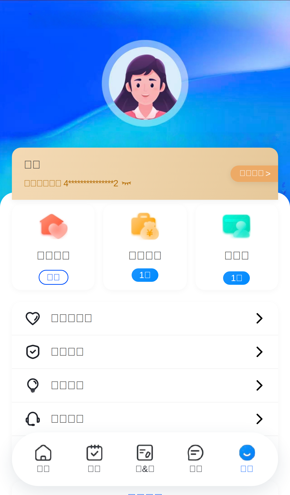
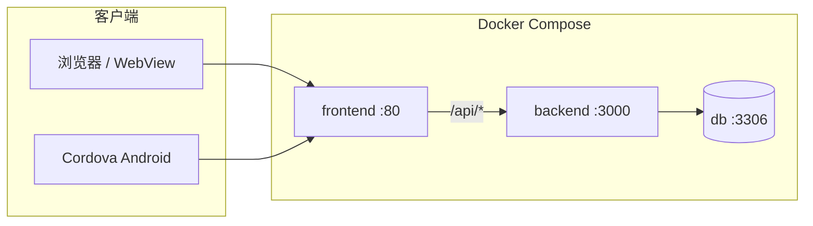

# 个人所得税演示平台 · 仿个税 APP 界面模拟器

**个税模拟系统** | 高仿真 H5 / Android 壳 | 演示办税、收入纳税明细、专项扣除、申报记录等界面与流程。

> **重要说明**  
> 本项目**仅用于学习演示、界面参考、技术交流**，**非国家税务总局或「个人所得税」官方软件**，**不具备真实申报、缴税、完税等税务法律效力**。请勿用于误导他人或任何违法违规用途。使用方须自行评估合规与数据安全。

---

## 软件截图

将界面截图放入仓库 `docs/images/` 目录后，可取消下方注释或替换文件名。

<!-- 
### 首页与登录


### 我的



### 收入纳税明细


### 个人中心 · 税务记录


-->

当前仓库未附带截图文件。部署后可在浏览器访问各页面自行截图，或参考同类开源展示页：[Elwoodw/personal-income-tax-simulator](https://github.com/Elwoodw/personal-income-tax-simulator)。

---

## 下载安装

安装包下载地址由**管理后台 → 系统设置 → 引导安装**配置，用户端统一从 **「安装包和使用方法」** 页面拉取最新链接。

| 端 | 说明 |
|----|------|
| **网页版（推荐先试）** | 浏览器打开已部署站点首页（默认进入登录/注册）。无需安装即可体验大部分功能。 |
| **安卓 / Android 版** | 在应用内打开「安装包和使用方法」，点击 **下载 Android 安装包（APK）**；或访问 `install_guide.html` 获取按钮。 |
| **苹果 iOS 版** | 在「安装包和使用方法」中下载 **iOS 描述文件（.mobileconfig）**，按页内 **苹果安装视频** 或管理后台配置的教程操作（需信任描述文件）。 |
| **PC 版** | 在 Windows 上可先安装 [雷电模拟器](https://www.ldmnq.com/) 等 Android 模拟器，再在模拟器内安装上述 **APK**，与手机端体验一致。 |

**典型访问路径（部署后请将 `你的域名` 换成实际地址）：**

- 用户端首页：`https://你的域名/`（跳转登录）
- 安装与教程：`https://你的域名/install_guide.html`
- 管理后台：`https://你的域名/admin_login.html`

本地 Docker 一键部署见下文 [开发者文档 · 快速开始](#快速开始docker)。

---

## 使用说明

### 1. 注册与激活

1. 打开 **网页版** 或 **APP**，完成 **注册**（手机号/账号按部署配置）。
2. 新账号需使用 **激活码** 激活后方可完整使用（`account_active`）。
3. 激活方式任选其一：
   - 在 **「我的」** 页点击 **激活**，输入激活码；
   - 通过 **闲鱼** 等渠道购买后，按卖家提供的激活码激活（APP 内可 **闲鱼购买** 复制购买文案，具体链接由后台配置）。

### 2. 日常使用（用户端）

| 模块 | 入口 | 功能概要 |
|------|------|----------|
| 首页 | `shouye.html` | 办税服务入口聚合 |
| 待办 / 办&查 | `daiban.html`、`bancha.html` | 待办与查询类演示页 |
| 消息 | `message.html` | 站内消息 |
| 我的 | `mine.html` | 个人信息卡、激活、我要咨询、关于与更新 |
| 个人中心 | `consult.html` | 任职受雇、消息管理、**税务记录**（批量添加工作经历与计税）、反馈 |
| 收入纳税明细 | `shuiming.html` → `shuiming_result.html` | 按年度查看收入列表与详情 `xiangqing.html` |
| 家庭成员 / 银行卡等 | `jtcy.html`、`yhk.html` 等 | 配套演示页面 |

**税务数据维护（核心）：**

1. 进入 **我的 → 我要咨询**（或 **个人中心 → 税务记录**）。
2. 在 **批量添加（累计预扣计税）** 中填写工作经历、月薪、社保与专项附加等；选填项「纳税人识别号 / 主管税务机关」默认折叠，需要时点击展开。
3. 可使用 **示例填写** 快速生成一段样例数据，保存后可在 **收入纳税明细** 中查看。

**修改姓名 / 税号 / 性别：** 在 **我的** 页点击姓名与税号区域，在弹窗中修改并保存。

### 3. 管理后台（运营 / 演示方）

1. 访问 `admin_login.html`，使用超级管理员账号登录（默认见环境变量 `ADMIN_PANEL_USER` / `ADMIN_PANEL_PASSWORD`，**部署后务必修改**）。
2. 常用菜单：**激活码**（含闲鱼批量）、**注册用户**、**引导安装**（APK / iOS 描述文件 / 闲鱼文案 / 安装视频）、**用户端外观**、**数据统计** 等。

### 4. 演示视频

- **苹果安装视频**、**操作视频**：在 `install_guide.html` 展示，视频地址在管理后台 **引导安装** 中配置（`install_ios_video`、`install_usage_video`）。
- 也可在 **关于&更新**（`about_update.html`）查看版本说明。

---

## 演示与仓库

| 项目 | 链接 |
|------|------|
| **本仓库（源码）** | https://github.com/as1285/test_platform |
| **界面参考（同类说明结构）** | https://github.com/Elwoodw/personal-income-tax-simulator |

---

## 常见问题

**Q：打开网页提示无法连接？**  
A：确认服务器已执行 `./scripts/deploy.sh`，云安全组已放行 **TCP 80**（HTTPS 需 443）。

**Q：安卓安装提示未知来源？**  
A：在系统设置中允许该来源安装 APK；仅安装可信渠道提供的包。

**Q：iOS 安装描述文件后打不开？**  
A：按 `install_guide.html` 视频步骤，在 **设置 → 通用 → VPN 与设备管理** 中信任描述文件。

**Q：激活码在哪里获取？**  
A：由演示运营方在管理后台生成，或通过已配置的闲鱼购买链接联系卖家（非官方税务渠道）。

---

## 开发者文档

以下为部署与二次开发说明；面向用户的上文 **下载 / 使用** 不依赖阅读本节。

### 技术栈

| 层级 | 技术 |
|------|------|
| 用户前端 | 静态 HTML/CSS/JS，Vite + Vue 3（部分入口） |
| 反向代理 | Nginx（Docker 80 端口，`/api/` 反代后端） |
| 后端 API | Node.js 18 + Express |
| 数据库 | MySQL 8.0 |
| 容器编排 | Docker Compose |
| 移动端壳 | Apache Cordova（`cordova-app/`，Android） |

### 系统架构



### 目录结构

```
test_platform/
├── backend/           # Express API（server.js、schema.sql）
├── frontend/          # H5 页面、admin_panel、nginx.conf
├── cordova-app/       # Android 壳工程
├── scripts/deploy.sh  # 一键构建并启动
├── docs/images/       # README 用截图（可自行添加）
└── docker-compose.yml
```

### 快速开始（Docker）

**环境要求**：Docker、Docker Compose。

```bash
git clone https://github.com/as1285/test_platform.git
cd test_platform
./scripts/deploy.sh
```

| 服务 | 地址 | 说明 |
|------|------|------|
| 用户端 | http://localhost/ | 根路径跳转登录 |
| 管理后台 | http://localhost/admin_login.html | |
| API 健康检查 | http://localhost:3000/api/health | |
| MySQL | localhost:3308 | 映射容器 3306 |

### 环境变量（摘要）

在 `docker-compose.yml` 的 `backend` 服务中配置：

| 变量 | 说明 |
|------|------|
| `JWT_SECRET` | 生产必须设置 |
| `ADMIN_PANEL_USER` / `ADMIN_PANEL_PASSWORD` | 管理后台登录 |
| `DB_*` | MySQL 连接 |
| `UPLOAD_DIR` | 上传目录（安装包、视频等） |

完整列表与 API 说明见仓库内历史文档注释及 `backend/server.js`。

### Cordova Android

```bash
cd cordova-app
cordova build android
```

应用显示名「个人所得税」；WebView 加载已部署 H5 地址（见 `config.xml`）。

### 生产安全清单

- [ ] 修改管理后台密码、`JWT_SECRET`、MySQL 密码  
- [ ] 配置 HTTPS  
- [ ] 限制管理后台访问来源  
- [ ] 定期备份数据库与上传卷  

---

## 许可证与用途

本仓库为演示 / 测试用途；根目录未声明开源许可证时，默认保留所有权利。使用前请确认业务合规性，并遵守相关法律法规。
