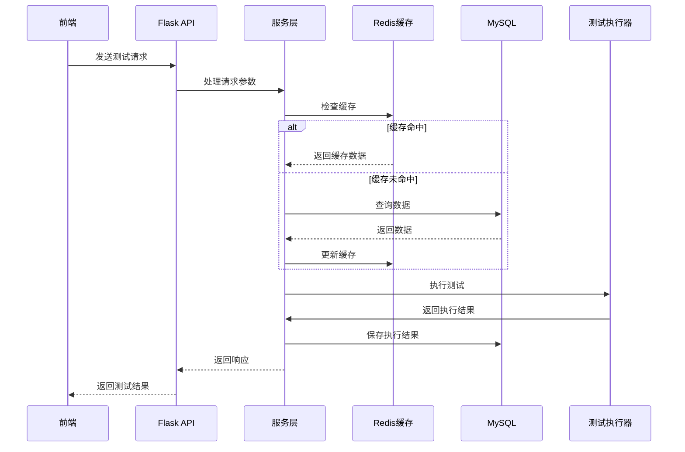

# 企业级接口测试平台架构设计文档

## 1. 整体架构

### 1.1 技术栈
- **后端**：Flask 2.0+（Python 3.9+）
- **前端**：Vue 3.0+ + Element Plus + ECharts
- **数据库**：MySQL 8.0+（主库）+ Redis 6.0+（缓存）
- **部署**：Docker + Docker Compose

### 1.2 模块划分

| 模块 | 职责 | 技术实现 |
|------|------|----------|
| 用户模块 | 用户认证、权限管理 | JWT鉴权、RBAC权限模型 |
| 用例模块 | 用例管理、分组、标签 | 分层存储、Redis缓存 |
| 测试模块 | 自动化测试、性能测试、鲁棒性测试 | Gevent高并发、AsyncIO异步 |
| 报告模块 | 报告生成、历史对比 | HTML/JSON格式、Redis缓存 |
| 监控模块 | 系统监控、资源占用 | 实时采集、数据可视化 |

### 1.3 核心流程图



## 2. 后端架构设计

### 2.1 分层架构

```
backend/
├── app/
│   ├── api/           # 控制器层（路由）
│   │   ├── user.py    # 用户相关接口
│   │   ├── case.py    # 用例相关接口
│   │   ├── test.py    # 测试相关接口
│   │   └── report.py  # 报告相关接口
│   ├── services/      # 服务层
│   │   ├── user_service.py
│   │   ├── case_service.py
│   │   ├── test_service.py
│   │   └── report_service.py
│   ├── models/        # 数据层
│   │   ├── user.py
│   │   ├── case.py
│   │   ├── test.py
│   │   └── report.py
│   ├── schemas/       # 数据校验
│   │   ├── user.py
│   │   ├── case.py
│   │   ├── test.py
│   │   └── report.py
│   ├── utils/         # 工具类
│   │   ├── jwt.py
│   │   ├── redis.py
│   │   └── validator.py
│   └── plugins/       # 插件系统
│       ├── base.py
│       └── websocket.py
├── config.py          # 配置文件
├── requirements.txt   # 依赖文件
└── run.py             # 启动文件
```

### 2.2 核心功能实现方案

#### 2.2.1 接口自动化测试
- **用例管理**：支持分组、标签、参数化、关联
- **用例执行**：单条/批量/定时执行，实时日志输出
- **报告生成**：HTML/JSON格式，支持历史对比

#### 2.2.2 接口性能测试
- **压测配置**：并发数、持续时间、阶梯加压
- **指标监控**：响应时间、TPS、QPS、错误率、服务器资源占用
- **结果分析**：性能瓶颈分析建议

#### 2.2.3 接口鲁棒性测试
- **异常注入**：参数越界、SQL注入试探、请求频率超限、返回数据格式错误
- **容错验证**：熔断、降级机制检查，异常返回规范验证
- **评分体系**：容错率、异常提示、恢复速度等维度评分

## 3. 前端架构设计

### 3.1 页面结构

```
frontend/
├── src/
│   ├── views/         # 页面组件
│   │   ├── user/      # 用户管理
│   │   ├── case/      # 用例管理
│   │   ├── test/      # 测试执行
│   │   └── report/    # 报告展示
│   ├── components/    # 通用组件
│   │   ├── charts/    # 图表组件
│   │   ├── forms/     # 表单组件
│   │   └── tables/    # 表格组件
│   ├── store/         # 状态管理
│   ├── router/        # 路由配置
│   ├── utils/         # 工具类
│   └── api/           # API调用
├── public/            # 静态资源
├── package.json       # 依赖配置
└── vite.config.js     # 构建配置
```

### 3.2 核心页面功能

| 页面 | 功能 | 技术实现 |
|------|------|----------|
| 用例管理页 | 用例CRUD、分组、标签、拖拽排序 | Element Plus Tree、拖拽组件 |
| 测试执行页 | 单条/批量执行、实时日志、参数配置 | WebSocket实时通信、表单组件 |
| 报告展示页 | HTML/JSON报告、历史对比、图表分析 | ECharts图表、Tab切换 |
| 性能测试页 | 压测配置、实时监控、结果分析 | 实时数据推送、多维度图表 |
| 鲁棒性测试页 | 异常注入配置、评分展示、详细报告 | 雷达图、表格展示 |

## 4. 数据库设计

### 4.1 核心表结构

- **用户表**：用户信息、权限
- **用例表**：用例基本信息、配置
- **用例分组表**：用例分组关系
- **用例标签表**：用例标签关系
- **测试执行表**：执行记录、状态
- **测试结果表**：详细执行结果
- **报告表**：报告信息、链接
- **性能测试表**：性能测试配置、结果
- **鲁棒性测试表**：鲁棒性测试配置、结果

### 4.2 索引策略
- 主键索引：所有表的ID字段
- 唯一索引：用户邮箱、用例名称
- 普通索引：执行状态、创建时间、分组ID
- 复合索引：常用查询条件组合

### 4.3 分表策略
- **测试结果表**：按时间分表（每月）
- **执行日志表**：按时间分表（每月）

## 5. 技术选型理由

### 5.1 后端技术选型
- **Flask**：轻量级框架，易于扩展，适合构建API服务
- **Gevent**：协程库，适合高并发场景
- **AsyncIO**：异步IO，提高并发处理能力
- **Redis**：缓存、消息队列，提高性能
- **MySQL**：关系型数据库，适合存储结构化数据

### 5.2 前端技术选型
- **Vue 3**：响应式框架，性能优异
- **Element Plus**：UI组件库，丰富的组件
- **ECharts**：数据可视化库，支持多种图表
- **WebSocket**：实时通信，适合日志实时输出

### 5.3 部署技术选型
- **Docker**：容器化部署，环境一致性
- **Docker Compose**：多容器编排，简化部署
- **Nginx**：反向代理，负载均衡

## 6. 性能优化策略

### 6.1 后端优化
- **缓存策略**：Redis缓存常用数据、测试结果
- **并发处理**：Gevent协程池、AsyncIO异步处理
- **数据库优化**：索引优化、分表分库
- **代码优化**：减少IO操作、优化算法

### 6.2 前端优化
- **资源优化**：代码分割、懒加载
- **渲染优化**：虚拟列表、防抖节流
- **网络优化**：请求合并、缓存策略

### 6.3 系统优化
- **负载均衡**：多实例部署、Nginx负载均衡
- **监控告警**：实时监控、异常告警
- **自动扩容**：根据负载自动调整实例数

## 7. 安全策略

### 7.1 后端安全
- **接口鉴权**：JWT token验证
- **参数校验**：请求参数严格校验
- **SQL注入防护**：ORM框架、参数化查询
- **XSS防护**：输入输出过滤
- **CSRF防护**：token验证
- **接口访问频率限制**：Redis实现

### 7.2 前端安全
- **XSS防护**：输入验证、输出转义
- **CSRF防护**：token携带
- **敏感信息保护**：加密存储、传输

## 8. 扩展性设计

### 8.1 插件系统
- **基础插件接口**：定义统一的插件接口
- **插件加载机制**：动态加载插件
- **内置插件**：WebSocket测试、MQ测试等

### 8.2 配置系统
- **环境变量配置**：不同环境不同配置
- **动态配置**：运行时可调整配置

### 8.3 API设计
- **RESTful API**：标准化接口设计
- **版本控制**：API版本管理
- **文档自动生成**：Swagger文档

## 9. 核心技术点

### 9.1 高并发测试执行
- 使用Gevent协程池管理并发
- 动态调整并发数
- 内存使用监控

### 9.2 实时日志输出
- WebSocket实时推送
- 日志分级管理
- 日志持久化

### 9.3 性能瓶颈分析
- 多维度指标采集
- 数据分析算法
- 智能建议生成

### 9.4 鲁棒性评分体系
- 多维度评分模型
- 权重动态调整
- 评分结果可视化

## 10. 总结

本架构设计文档详细规划了企业级接口测试平台的技术实现方案，涵盖了核心功能、技术选型、架构设计、数据库设计、性能优化、安全策略和扩展性设计等方面。通过采用先进的技术栈和设计理念，确保平台具有高并发处理能力、可扩展性和安全性，能够满足企业级接口测试的需求。