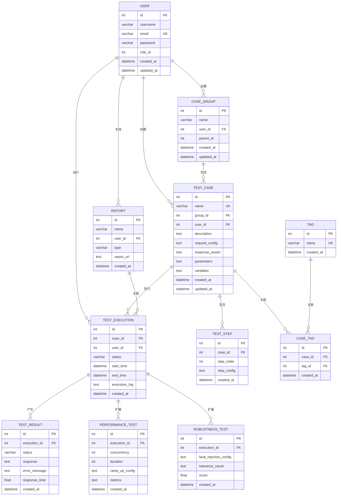

# 企业级接口测试平台数据库设计

## 1. ER图



## 2. 建表语句

### 2.1 用户表

```sql
CREATE TABLE `user` (
  `id` INT UNSIGNED NOT NULL AUTO_INCREMENT,
  `username` VARCHAR(50) NOT NULL,
  `email` VARCHAR(100) NOT NULL,
  `password` VARCHAR(100) NOT NULL,
  `role_id` INT UNSIGNED DEFAULT 1,
  `created_at` DATETIME NOT NULL DEFAULT CURRENT_TIMESTAMP,
  `updated_at` DATETIME NOT NULL DEFAULT CURRENT_TIMESTAMP ON UPDATE CURRENT_TIMESTAMP,
  PRIMARY KEY (`id`),
  UNIQUE KEY `uk_email` (`email`),
  INDEX `idx_role_id` (`role_id`)
) ENGINE=InnoDB DEFAULT CHARSET=utf8mb4;
```

### 2.2 用例分组表

```sql
CREATE TABLE `case_group` (
  `id` INT UNSIGNED NOT NULL AUTO_INCREMENT,
  `name` VARCHAR(100) NOT NULL,
  `user_id` INT UNSIGNED NOT NULL,
  `parent_id` INT UNSIGNED DEFAULT NULL,
  `created_at` DATETIME NOT NULL DEFAULT CURRENT_TIMESTAMP,
  `updated_at` DATETIME NOT NULL DEFAULT CURRENT_TIMESTAMP ON UPDATE CURRENT_TIMESTAMP,
  PRIMARY KEY (`id`),
  INDEX `idx_user_id` (`user_id`),
  INDEX `idx_parent_id` (`parent_id`),
  FOREIGN KEY (`user_id`) REFERENCES `user` (`id`) ON DELETE CASCADE
) ENGINE=InnoDB DEFAULT CHARSET=utf8mb4;
```

### 2.3 测试用例表

```sql
CREATE TABLE `test_case` (
  `id` INT UNSIGNED NOT NULL AUTO_INCREMENT,
  `name` VARCHAR(100) NOT NULL,
  `group_id` INT UNSIGNED NOT NULL,
  `user_id` INT UNSIGNED NOT NULL,
  `description` TEXT,
  `request_config` TEXT NOT NULL,
  `response_assert` TEXT,
  `parameters` TEXT,
  `variables` TEXT,
  `created_at` DATETIME NOT NULL DEFAULT CURRENT_TIMESTAMP,
  `updated_at` DATETIME NOT NULL DEFAULT CURRENT_TIMESTAMP ON UPDATE CURRENT_TIMESTAMP,
  PRIMARY KEY (`id`),
  UNIQUE KEY `uk_name` (`name`),
  INDEX `idx_group_id` (`group_id`),
  INDEX `idx_user_id` (`user_id`),
  FOREIGN KEY (`group_id`) REFERENCES `case_group` (`id`) ON DELETE CASCADE,
  FOREIGN KEY (`user_id`) REFERENCES `user` (`id`) ON DELETE CASCADE
) ENGINE=InnoDB DEFAULT CHARSET=utf8mb4;
```

### 2.4 测试步骤表

```sql
CREATE TABLE `test_step` (
  `id` INT UNSIGNED NOT NULL AUTO_INCREMENT,
  `case_id` INT UNSIGNED NOT NULL,
  `step_order` INT UNSIGNED NOT NULL,
  `step_config` TEXT NOT NULL,
  `created_at` DATETIME NOT NULL DEFAULT CURRENT_TIMESTAMP,
  PRIMARY KEY (`id`),
  INDEX `idx_case_id` (`case_id`),
  INDEX `idx_step_order` (`step_order`),
  FOREIGN KEY (`case_id`) REFERENCES `test_case` (`id`) ON DELETE CASCADE
) ENGINE=InnoDB DEFAULT CHARSET=utf8mb4;
```

### 2.5 标签表

```sql
CREATE TABLE `tag` (
  `id` INT UNSIGNED NOT NULL AUTO_INCREMENT,
  `name` VARCHAR(50) NOT NULL,
  `created_at` DATETIME NOT NULL DEFAULT CURRENT_TIMESTAMP,
  PRIMARY KEY (`id`),
  UNIQUE KEY `uk_name` (`name`)
) ENGINE=InnoDB DEFAULT CHARSET=utf8mb4;
```

### 2.6 用例标签关联表

```sql
CREATE TABLE `case_tag` (
  `id` INT UNSIGNED NOT NULL AUTO_INCREMENT,
  `case_id` INT UNSIGNED NOT NULL,
  `tag_id` INT UNSIGNED NOT NULL,
  `created_at` DATETIME NOT NULL DEFAULT CURRENT_TIMESTAMP,
  PRIMARY KEY (`id`),
  INDEX `idx_case_id` (`case_id`),
  INDEX `idx_tag_id` (`tag_id`),
  FOREIGN KEY (`case_id`) REFERENCES `test_case` (`id`) ON DELETE CASCADE,
  FOREIGN KEY (`tag_id`) REFERENCES `tag` (`id`) ON DELETE CASCADE
) ENGINE=InnoDB DEFAULT CHARSET=utf8mb4;
```

### 2.7 测试执行表

```sql
CREATE TABLE `test_execution` (
  `id` INT UNSIGNED NOT NULL AUTO_INCREMENT,
  `case_id` INT UNSIGNED NOT NULL,
  `user_id` INT UNSIGNED NOT NULL,
  `status` VARCHAR(20) NOT NULL,
  `start_time` DATETIME,
  `end_time` DATETIME,
  `execution_log` TEXT,
  `created_at` DATETIME NOT NULL DEFAULT CURRENT_TIMESTAMP,
  PRIMARY KEY (`id`),
  INDEX `idx_case_id` (`case_id`),
  INDEX `idx_user_id` (`user_id`),
  INDEX `idx_status` (`status`),
  INDEX `idx_start_time` (`start_time`),
  FOREIGN KEY (`case_id`) REFERENCES `test_case` (`id`) ON DELETE CASCADE,
  FOREIGN KEY (`user_id`) REFERENCES `user` (`id`) ON DELETE CASCADE
) ENGINE=InnoDB DEFAULT CHARSET=utf8mb4;
```

### 2.8 测试结果表（按月分表）

```sql
-- 主表
CREATE TABLE `test_result` (
  `id` INT UNSIGNED NOT NULL AUTO_INCREMENT,
  `execution_id` INT UNSIGNED NOT NULL,
  `status` VARCHAR(20) NOT NULL,
  `response` TEXT,
  `error_message` TEXT,
  `response_time` FLOAT,
  `created_at` DATETIME NOT NULL DEFAULT CURRENT_TIMESTAMP,
  PRIMARY KEY (`id`),
  INDEX `idx_execution_id` (`execution_id`),
  INDEX `idx_status` (`status`),
  INDEX `idx_created_at` (`created_at`),
  FOREIGN KEY (`execution_id`) REFERENCES `test_execution` (`id`) ON DELETE CASCADE
) ENGINE=InnoDB DEFAULT CHARSET=utf8mb4;

-- 分表示例（2024年1月）
CREATE TABLE `test_result_202401` (
  LIKE `test_result` INCLUDING ALL
);

-- 分表触发器
DELIMITER //
CREATE TRIGGER `test_result_insert_trigger` BEFORE INSERT ON `test_result`
FOR EACH ROW
BEGIN
    DECLARE table_name VARCHAR(50);
    SET table_name = CONCAT('test_result_', DATE_FORMAT(NEW.created_at, '%Y%m'));
    -- 检查分表是否存在，不存在则创建
    SET @sql = CONCAT('CREATE TABLE IF NOT EXISTS ', table_name, ' LIKE test_result');
    PREPARE stmt FROM @sql;
    EXECUTE stmt;
    DEALLOCATE PREPARE stmt;
    -- 插入数据到分表
    SET @sql = CONCAT('INSERT INTO ', table_name, ' VALUES (?, ?, ?, ?, ?, ?, ?)');
    PREPARE stmt FROM @sql;
    SET @id = NEW.id;
    SET @execution_id = NEW.execution_id;
    SET @status = NEW.status;
    SET @response = NEW.response;
    SET @error_message = NEW.error_message;
    SET @response_time = NEW.response_time;
    SET @created_at = NEW.created_at;
    EXECUTE stmt USING @id, @execution_id, @status, @response, @error_message, @response_time, @created_at;
    DEALLOCATE PREPARE stmt;
    -- 阻止插入主表
    SIGNAL SQLSTATE '45000' SET MESSAGE_TEXT = 'Data inserted into partition table';
END//
DELIMITER ;
```

### 2.9 性能测试表

```sql
CREATE TABLE `performance_test` (
  `id` INT UNSIGNED NOT NULL AUTO_INCREMENT,
  `execution_id` INT UNSIGNED NOT NULL,
  `concurrency` INT UNSIGNED NOT NULL,
  `duration` INT UNSIGNED NOT NULL,
  `ramp_up_config` TEXT,
  `metrics` TEXT NOT NULL,
  `created_at` DATETIME NOT NULL DEFAULT CURRENT_TIMESTAMP,
  PRIMARY KEY (`id`),
  UNIQUE KEY `uk_execution_id` (`execution_id`),
  FOREIGN KEY (`execution_id`) REFERENCES `test_execution` (`id`) ON DELETE CASCADE
) ENGINE=InnoDB DEFAULT CHARSET=utf8mb4;
```

### 2.10 鲁棒性测试表

```sql
CREATE TABLE `robustness_test` (
  `id` INT UNSIGNED NOT NULL AUTO_INCREMENT,
  `execution_id` INT UNSIGNED NOT NULL,
  `fault_injection_config` TEXT NOT NULL,
  `tolerance_result` TEXT,
  `score` FLOAT DEFAULT 0,
  `created_at` DATETIME NOT NULL DEFAULT CURRENT_TIMESTAMP,
  PRIMARY KEY (`id`),
  UNIQUE KEY `uk_execution_id` (`execution_id`),
  INDEX `idx_score` (`score`),
  FOREIGN KEY (`execution_id`) REFERENCES `test_execution` (`id`) ON DELETE CASCADE
) ENGINE=InnoDB DEFAULT CHARSET=utf8mb4;
```

### 2.11 报告表

```sql
CREATE TABLE `report` (
  `id` INT UNSIGNED NOT NULL AUTO_INCREMENT,
  `name` VARCHAR(100) NOT NULL,
  `user_id` INT UNSIGNED NOT NULL,
  `type` VARCHAR(20) NOT NULL,
  `report_url` TEXT NOT NULL,
  `created_at` DATETIME NOT NULL DEFAULT CURRENT_TIMESTAMP,
  PRIMARY KEY (`id`),
  INDEX `idx_user_id` (`user_id`),
  INDEX `idx_type` (`type`),
  FOREIGN KEY (`user_id`) REFERENCES `user` (`id`) ON DELETE CASCADE
) ENGINE=InnoDB DEFAULT CHARSET=utf8mb4;
```

## 3. 索引优化策略

### 3.1 聚集索引
- 所有表的主键字段都使用自增ID，确保插入性能
- 对于频繁范围查询的字段，考虑使用聚集索引

### 3.2 唯一索引
- 用户邮箱、用例名称、标签名称等唯一字段使用唯一索引
- 性能测试和鲁棒性测试的execution_id使用唯一索引

### 3.3 普通索引
- 外键字段都建立索引，加速关联查询
- 状态字段、时间字段建立索引，加速条件查询
- 常用查询条件组合建立复合索引

### 3.4 覆盖索引
- 对于频繁查询的字段组合，建立覆盖索引，减少回表操作
- 例如：测试执行表的(case_id, status, start_time)组合索引

## 4. 分表策略

### 4.1 水平分表
- **测试结果表**：按月份分表，每月创建一个新表
- **执行日志表**：按月份分表，存储详细的执行日志

### 4.2 分表优势
- 减少单表数据量，提高查询性能
- 便于数据归档和清理
- 分散写入压力，提高并发性能

### 4.3 分表实现
- 使用触发器自动创建分表
- 应用层根据时间范围选择对应分表
- 支持跨分表查询的视图或存储过程

## 5. 数据库连接池配置

### 5.1 连接池参数
- **最小连接数**：5
- **最大连接数**：100
- **连接超时**：30秒
- **空闲超时**：600秒

### 5.2 读写分离
- 主库负责写操作
- 从库负责读操作，提高查询性能

## 6. 数据备份策略

### 6.1 备份方案
- **全量备份**：每天凌晨执行
- **增量备份**：每小时执行
- **binlog备份**：实时备份

### 6.2 恢复策略
- 定期测试备份恢复
- 制定详细的灾难恢复计划

## 7. 总结

本数据库设计文档详细规划了企业级接口测试平台的数据库结构，包括ER图、建表语句、索引优化策略、分表策略和备份策略等。通过合理的表结构设计和优化策略，确保数据库在高并发场景下的性能和可靠性，为整个测试平台提供稳定的数据支持。